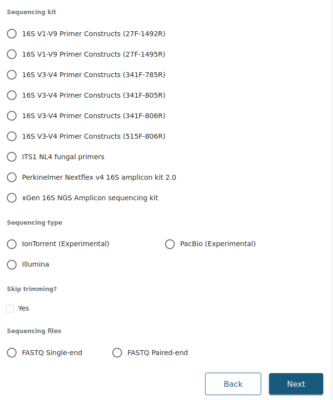

Usage
=====

.. _input:

Input
------------

When submitting a job to the 16S pipeline, you will be presented with the following screen:

.. _options:

Options
------------

Sequencing kit
++++++++++++++

Here you can select the sequencing kit used to obtain the data. We currently have the following sequencing kits and oligos available, but if the kit your are looking for is not in the list, do not hesitate to contact us and we will add it as soon as possible.

* **16S V1-V9 Primer Constructs (27F-1492R)**
   * **Forward sequence**: AGAGTTTGATCMTGGCTCAG
   * **Reverse sequence**: TTCAGCATTGTTCCATTGG
* **16S V1-V9 Primer Constructs (27F-1495R)**
   * **Forward sequence**: GAGAGTTTGATCCTGGCTCAG
   * **Reverse sequence**: AGCATTGTTCCATCGGCATC
* **16S V3-V4 Primer Constructs (341F-785R)**
   * **Forward sequence**: CCTACGGGNGGCWGCAG
   * **Reverse sequence**: GACTACHVGGGTATCTAATCC
* **16S V3-V4 Primer Constructs (341F-805R)**
   * **Forward sequence**: CCTACGGGNGGCWGCAG
   * **Reverse sequence**: GGATTAGATACCCVHGTAGTC
* **16S V3-V4 Primer Constructs (515F-806R)**
   * **Forward sequence**: GTGYCAGCMGCCGCGGTAA
   * **Reverse sequence**: GGACTACNVGGGTWTCTAAT
* **ITS NL4 fungal primers**:
   * **Forward sequence**: TCCGTAGGTGAACCTGCGG
   * **Reverse sequence**: GGTCCGTGTTTCAAGACGG
* **Perkinelmer Nextflex v4 16S amplicon kit 2.0**
   * **Forward sequence**: GACGCTCTTCCGATCTTATGGTAATTGTGTGCCAGCMGCCGCGGTAA
   * **Reverse sequence**: TGTGCTCTTCCGATCTAGTCAGTCAGCCGGACTACHVGGGTWTCTAAT
* **xGen 16S NGS Amplicon sequencing kit.**
   * The xGen 16S rRNA v2 Amplicon Panel targets V1–V9 variable regions of the 16S rRNA gene.

